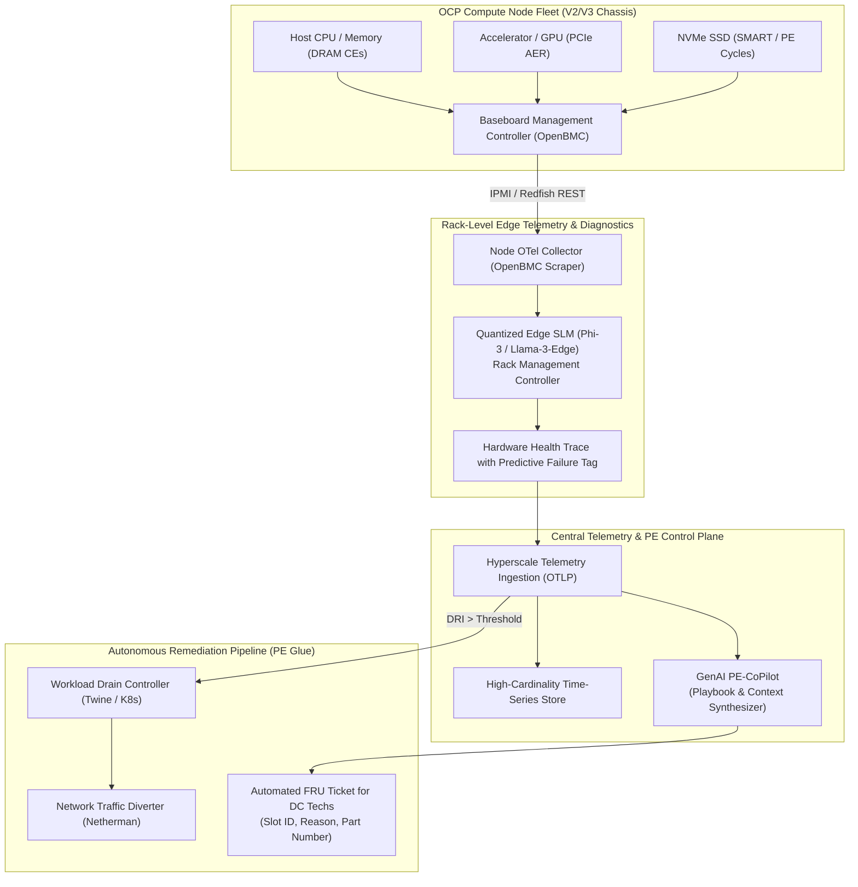

# Open Compute Efficiency: Predictive Hardware Reliability & Fleet Health Control Plane ⚡

> **Hyperscale hardware reliability framework integrating Open Compute Project (OCP) standards, OpenBMC telemetry, edge-quantized SLM diagnostics, and automated fleet auto-remediation.**

[-blue.svg)](https://www.opencompute.org/)
[](#1-unified-telemetry-via-openbmc-and-otel)
[-purple.svg)](#2-edge-slm-pre-failure-log-diagnostics)
[](#3-automated-fleet-remediation-pipeline)
[](#hyperscale-production-engineering-tool-mapping)
[](LICENSE)

---

## 🧭 Executive Summary & Infrastructure Thesis

In hyperscale compute fleets operating hundreds of thousands of servers, hardware failures are statistical certainties. Traditional data center operational models rely on **reactive hardware replacement**: a node crashes from an uncorrectable multi-bit memory error (UE) or PCIe bus hang, triggering a hard reboot, crash dump generation, and manual ticket routing to data center technicians.

This reactive posture imposes severe penalties on hyperscale economics:
1. **Unplanned Workload Disruption:** In-flight batch training jobs or distributed database transactions crash abruptly rather than migrating gracefully.
2. **Silent Data Corruption (SDC):** Sub-threshold memory and arithmetic degradation can corrupt model weights or financial transactions before an outright panic occurs.
3. **Data Center Technician Cognitive Load:** Technicians receive ambiguous tickets requiring hours of physical board swaps and manual troubleshooting.

**Open Compute Efficiency** re-architects physical infrastructure operations as a software problem. By coupling **OpenTelemetry (OTel)** hardware collectors with **edge-quantized Small Language Models (SLMs)** running on rack controllers or management processors, the platform detects micro-signatures of component degradation (PCIe Advanced Error Reporting, DRAM correctable error deltas, thermal gradient anomalies) days before physical breakdown, triggering automated workload drains and context-rich component repair dispatches.

---

## 📐 Mathematical Formulation of Hardware Degradation

To predict component failure before an uncorrectable crash occurs, the platform calculates a real-time **Hardware Degradation Risk Index ($DRI$)**:

$$DRI(t) = \alpha \cdot \frac{d}{dt}\left[\text{CE}_{\text{DRAM}}(t)\right] + \beta \cdot \sum_{\tau = t - W}^{t} \text{AER}_{\text{PCIe}}(\tau) + \gamma \cdot \left(\frac{T_{\text{junction}}(t) - T_{\text{baseline}}}{T_{\text{throttle}} - T_{\text{baseline}}}\right) + \delta \cdot \text{PE}_{\text{Storage}}(t)$$

Where:
- $\frac{d}{dt}\left[\text{CE}_{\text{DRAM}}(t)\right]$ is the rate of correctable memory errors (bursts indicate imminent multi-bit uncorrectable failure).
- $\text{AER}_{\text{PCIe}}$ represents PCIe Advanced Error Reporting events (correctable link retries indicating signal degradation).
- $T_{\text{junction}}$ is the die temperature relative to thermal throttling limits.
- $\text{PE}_{\text{Storage}}$ is the Program/Erase cycle exhaustion delta on NVMe SSD flash media.
- $\alpha, \beta, \gamma, \delta$ are empirically calibrated weighting coefficients.

When $DRI(t) > \text{Threshold}_{\text{Drain}}$, the node is marked **Degraded / Drain-Pending**, initiating preemptive container migration without human intervention.

---

## 🏛️ System Architecture



---

## 🔬 Core Capabilities

### 1. Unified Telemetry via OpenBMC and OTel
- Scrapes **OpenBMC Redfish APIs**, system event logs (SEL), and Linux kernel ring buffers (`dmesg`, `edac`, `mcelog`) via a specialized OpenTelemetry collector daemon.
- Correlates low-level physical telemetry with high-level container IDs and Kubernetes pod execution contexts.
- Emits standardized OTel Spans representing physical component lifecycle events.

### 2. Edge SLM Pre-Failure Log Diagnostics
- Deploys quantized (GGUF / INT4) Small Language Models running locally on rack-leader nodes or chassis management controllers.
- Parses noisy kernel logs and hardware telemetry streams in real time, detecting nuanced pre-failure patterns that static regex rules miss:

| Diagnostic Method | Static Regex Pattern Matching | Edge SLM Predictive Engine |
| :--- | :--- | :--- |
| **DRAM Degradation** | Triggers only after crash / MCE panic | Flags burst frequency acceleration 48h prior |
| **PCIe Interconnect** | Ignores link retraining events | Identifies eye-diagram degradation and retries |
| **Thermal Anomalies** | Hard trip at maximum ceiling ($105^\circ\text{C}$) | Detects abnormal cooling gradient drift at nominal loads |
| **False Positive Rate** | High (triggers tickets on transient glitches) | Extremely low (multi-signal semantic correlation) |

### 3. Automated Fleet Remediation Pipeline ("The PE Glue")
- **Phase 1: Preemptive Drain:** When degradation is confirmed, communicates with the hyperscale scheduler (e.g., Meta Twine or Kubernetes) to cordon the node and gracefully drain running workloads.
- **Phase 2: Network Isolation:** Invokes network orchestration (e.g., Netherman) to reroute upstream load balancer traffic.
- **Phase 3: Automated FRU Dispatch:** Synthesizes an actionable Field Replaceable Unit (FRU) ticket containing exact DIMM slot locations, vendor part numbers, and an AI-generated explanation of the failure mode.

---

## 🏢 Hyperscale Production Engineering Tool Mapping

This architecture embodies the battle-tested operational patterns used across the world's largest hyperscale data centers:

| Hyperscale Production System | Open-Source / Standard Equivalent | Function in Hardware Reliability Platform |
| :--- | :--- | :--- |
| **FBAR (Facebook Auto-Remediation)** | Custom Kubernetes Operator / Remediator | Executes safe, automated remediation workflows on degraded nodes. |
| **Twine** | Kubernetes / Slurm Cluster Scheduler | Manages container lifecycle and graceful task drainage across regions. |
| **Netherman** | Calico / Cilium / BGP Traffic Controller | Coordinates top-of-rack (ToR) and network-level traffic drains during maintenance. |
| **Scuba** | ClickHouse / Apache Pinot | Real-time multi-dimensional querying of hardware health telemetry. |
| **Open Compute Project (OCP)** | OCP Open Systems Architecture | Standardized hardware specifications, OpenBMC firmware, and mechanical modularity. |

---

## 📋 Context-Aware DC Technician Repair Playbook Example

When a node requires physical component intervention, the GenAI PE-CoPilot generates an unambiguous technician guide directly attached to the work order:

```markdown
### 🛠️ Work Order: NODE-RACK-04A-SLOT-12 (CRITICAL)
- **Component Identified:** Memory DIMM Failure Imminent
- **Physical Location:** Slot CPU0_DIMM_B2 (SK Hynix 64GB DDR5-4800 ECC)
- **Telemetry Evidence:** 142 correctable errors in 15 minutes; address line A14 exhibiting bit-stuck pattern.
- **Automated Actions Completed:**
  - [x] Node cordoned in Twine/Kubernetes (2026-10-01 02:14 UTC)
  - [x] 18 workloads drained with zero user impact (Drain time: 42s)
  - [x] BGP traffic diverted at ToR switch
- **Technician Action Required:**
  1. Verify blue chassis UID locator LED is illuminated.
  2. Unseat and replace module at CPU0_DIMM_B2 with Part #HMCG94MEBRA.
  3. Reseat and trigger automated diagnostic verification loop via mobile app.
```

---

## 📂 Repository Topology

```text
open-compute-efficiency/
├── README.md               # Executive Architecture & Hyperscale Infrastructure Specification
├── PROPOSAL.md             # Original RFC & Production Engineering Motivation
└── docs/                   # Hardware failure modes, telemetry schemas & OCP benchmarks
```

---

## 📄 License & Contact

Distributed under the **MIT License**. Maintained by **Hooman Parta** ([@hoomanp](https://github.com/hoomanp)).
